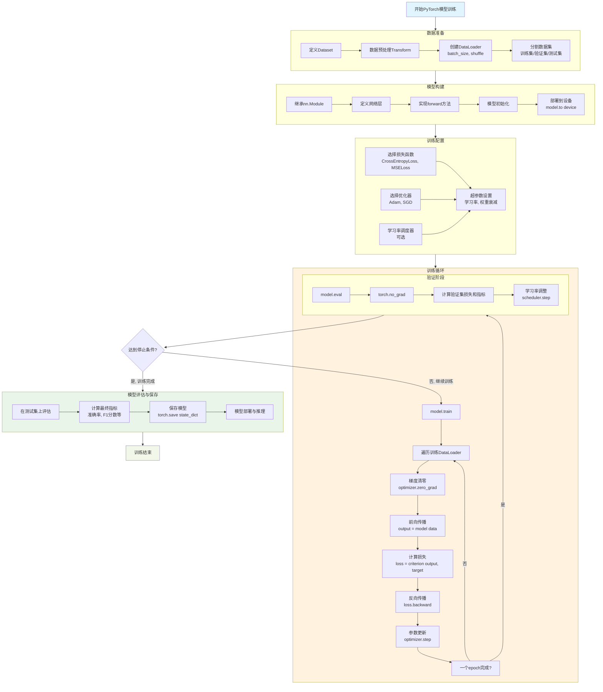

# 核心思路
## Main features
1. **Tensor(张量)：** 不同于普通数组或向量，张量能够在GPU上运行并计算
2. **Autograd：** 基于反向传播理论对所有张量进行自动地梯度求解
3. **NN：** `nn.Module` 集成化地训练框架库，能够便捷搭建神经网络框架
4. **Optimizers:** 使用各种优化器（SGD、Adam等）来更新模型地参数
5. **Device：** 将模型转移到特定地设备上训练


# PyTorch 生态系统架构

| 层级        | 模块名称               | 主要功能   | 关键组件                         |
| --------- | ------------------ | ------ | ---------------------------- |
| **专业领域库** | `torchvision`      | 计算机视觉  | 数据集、模型、变换                    |
|           | `torchtext`        | 自然语言处理 | 文本处理、词向量                     |
|           | `torchaudio`       | 音频处理   | 音频数据集、处理工具                   |
|           | 其他领域库              | 专业应用   | 图神经网络、强化学习等                  |
| **训练框架**  | `torch.nn`         | 神经网络构建 | Module, Linear, Conv2d, Loss |
|           | `torch.optim`      | 优化算法   | SGD, Adam, lr_scheduler      |
|           | `torch.utils`      | 训练工具   | DataLoader, TensorBoard      |
| **核心引擎**  | torch 核心           | 张量计算   | Tensor 操作、数学函数               |
|           | `autograd`         | 自动求导   | 计算图、梯度计算                     |
|           | `torch.utils.data` | 数据管道   | Dataset, DataLoader, Sampler |

# Pytorch基本训练框架




# 各模块简介
### **PyTorch训练框架模块化核心知识点讲解**

**总体理念：深度学习可以看作一个“备料 -> 烹饪 -> 品尝 -> 反思 -> 改进”的循环优化过程。**

---

### **模块一：数据准备 (Data Preparation)**

- **核心目标：** 将原始数据转换为模型可处理、可迭代的mini-batch数据流。
- **理论依据（教材）：** 数据集划分（训练集/测试集）、mini-batch学习（提高训练效率、利于收敛）。
- **PyTorch核心类：**
    1. `torch.utils.data.Dataset` (抽象类)
        - **功能：** 定义数据的读取方式和单个样本的预处理。
        - **必须实现的方法：**
            - `__getitem__(self, index)`：根据索引返回一个样本（数据，标签）。
            - `__len__(self)`：返回数据集的总大小。
        - **知识点：** 这是数据处理的基石，封装了数据来源。
    2. `torch.utils.data.DataLoader`
        - **功能：** 将`Dataset`包装成一个可迭代的加载器，自动实现mini-batch生成、打乱数据、多进程并行加载。
        - **关键参数：**
            - `batch_size`：每个mini-batch的大小。
            - `shuffle`：是否在每个epoch开始时打乱数据。
            - `num_workers`：用于数据加载的子进程数，加速数据读取。
        - **知识点：** 它负责将`Dataset`提供的单个样本“组装”成模型需要的批量数据。

---

### **模块二：模型定义 (Model Definition)**

- **核心目标：** 构建一个由可学习参数（权重和偏置）组成的计算图，用以拟合输入和输出之间的复杂关系。
- **理论依据（教材）：** 神经网络层（全连接、卷积、池化）、激活函数（Sigmoid, ReLU）、前向传播。
- **PyTorch核心类：** `torch.nn.Module` (所有神经网络模块的基类)
    - **构建步骤：**
        1. **继承**：自定义模型类必须继承`nn.Module`。
        2. **初始化**：在`__init__`方法中定义网络层。这些层通常是`nn.Module`的子类（如`nn.Linear`, `nn.Conv2d`）。
            
            ```
            super(MyModel, self).__init__()
            self.linear1 = nn.Linear(784, 256) # 输入784维，输出256维
            self.linear2 = nn.Linear(256, 10)  # 输入256维，输出10维（如10分类）
            ```
            
        3. **前向传播**：重写`forward(self, x)`方法，定义数据如何从输入流到输出。
            
            ```
            def forward(self, x):
                x = torch.relu(self.linear1(x)) # 线性变换后接ReLU激活函数
                x = self.linear2(x)             # 输出层，通常不接激活函数（损失函数会处理）
                return x
            ```
            
    - **核心知识点：**
        - **计算图：** `forward`方法定义了动态计算图。PyTorch会自动记录所有操作，用于后续的梯度计算。
        - **参数管理：** 通过`model.parameters()`方法可以获取模型中所有可学习参数，这是传递给优化器的关键。

---

### **模块三：损失函数与优化器 (Loss Function & Optimizer)**

- **核心目标：** 量化模型预测的“错误程度”（损失函数），并定义如何根据这个错误来更新模型参数（优化器）。
- **理论依据（教材）：** 均方误差、交叉熵误差、梯度下降法（SGD）、梯度下降法的优化（Momentum, Adam）。
- **PyTorch实现：**
    1. **损失函数 (Criterion/Loss)：**
        - **位置：** `torch.nn` 模块下。
        - **常见类型：**
            - `nn.MSELoss()`： 回归问题。
            - `nn.CrossEntropyLoss()`： 多分类问题。
        - **使用方法：** `loss = criterion(model_output, true_labels)`
        - **知识点：** 损失值是一个标量，是衡量模型性能好坏和驱动模型学习的直接指标。
    2. **优化器 (Optimizer)：**
        - **位置：** `torch.optim` 模块下。
        - **常见类型：** `optim.SGD`, `optim.Adam`。
        - **初始化：** 需要传入待优化的参数（通常来自`model.parameters()`）和学习率等超参数。
            
            ```
            optimizer = torch.optim.Adam(model.parameters(), lr=0.001)
            ```
            
        - **核心方法：**
            - `optimizer.zero_grad()`： **清空梯度**。防止梯度累加到下一次迭代。
            - `optimizer.step()`： **执行参数更新**。根据计算出的梯度更新模型参数。

---

### **模块四：核心训练循环 (Training Loop)**

- **核心目标：** 重复执行“前向-损失-反向-更新”步骤，使模型参数不断迭代优化，最终让损失值最小化。
- **理论依据（教材）：** 误差反向传播法、计算图、链式法则。
- **代码流程（一个epoch内的循环）：**
    
    ```
    for data in dataloader: # 从DataLoader中取出一个mini-batch
        inputs, labels = data
    
        # 1. 清空梯度
        optimizer.zero_grad()
    
        # 2. 前向传播：计算预测值
        outputs = model(inputs)
    
        # 3. 计算损失：量化预测值与真实值的差距
        loss = criterion(outputs, labels)
    
        # 4. 反向传播：计算损失函数关于每个参数的梯度
        loss.backward()
    
        # 5. 参数更新：根据梯度调整参数
        optimizer.step()
    ```
    
- **核心知识点：**
    - `loss.backward()`是**关键魔法**。PyTorch利用动态计算图和链式法则，自动计算所有`requires_grad=True`的张量的梯度，并存储在对应张量的`.grad`属性中。
    - 步骤顺序至关重要，尤其`zero_grad()`必须在`backward()`和`step()`之间。

---

### **模块五：模型验证与评估 (Validation & Evaluation)**

- **核心目标：** 监控模型在未见过的数据（验证集/测试集）上的表现，防止过拟合，并最终评估模型性能。
- **理论依据（教材）：** 过拟合、泛化能力、超参数验证。
- **PyTorch关键操作：** `with torch.no_grad():`
    - **代码示例：**
        
        ```
        model.eval() # 将模型设置为评估模式（关闭Dropout等）
        with torch.no_grad(): # 禁用梯度计算，节省内存和计算
            for data in test_dataloader:
                inputs, labels = data
                outputs = model(inputs)
                # ... 计算准确率等指标 ...
        model.train() # 切换回训练模式
        ```
        
    - **核心知识点：**
        - `no_grad()`： 在此上下文管理器内，不会构建计算图，极大提升计算效率并节省内存。
        - `model.eval()`： 改变某些层（如Dropout和BatchNorm）的行为，使其适用于推理而非训练。

---

### **模块六：附加核心概念 (Core Concepts)**

1. **设备管理 (Device Management)：**
    
    - **代码：** `device = torch.device('cuda' if torch.cuda.is_available() else 'cpu')`
    - **动作：** `model.to(device)`; `data = data.to(device)`
    - **知识点：** 利用GPU的并行计算能力，极大加速训练和推理过程。
2. **模型状态 (Model Status)：**
    
    - `model.train()`： **训练模式**。启用Dropout、BatchNorm使用当前batch的统计量。
    - `model.eval()`： **评估模式**。关闭Dropout、BatchNorm使用运行平均值。
    - **知识点：** 这是确保训练和评估行为一致性的重要设置。

