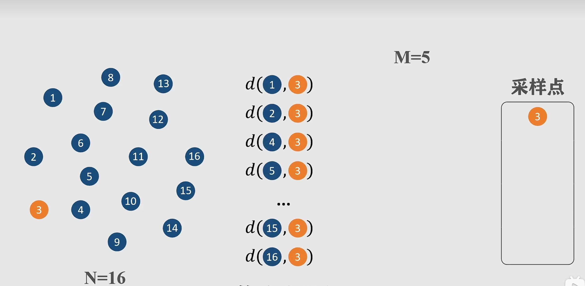
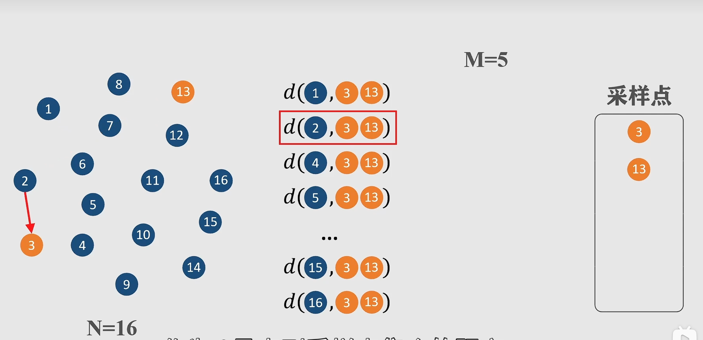
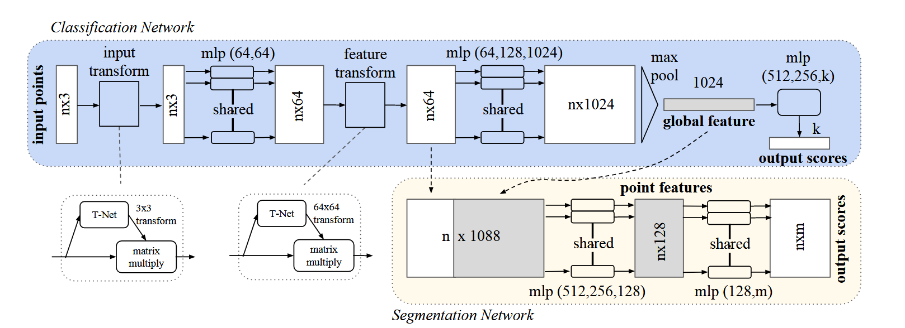
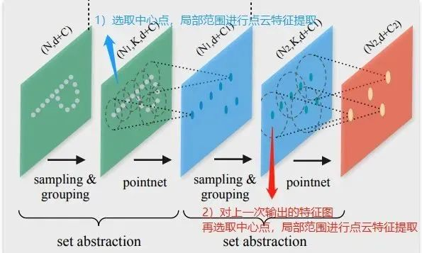

# 原始论文
[pointnet++](https://arxiv.org/pdf/1706.02413)
[pointnet](https://arxiv.org/pdf/1612.00593)
# 点云下采样（最远点采样Farthest Point Sampling,FPS）
***目的：在减少点云数量的同时，尽可能保留物体的几何特征**

随机选取边缘采样点

选择距离第一个采样点最远的点为第二个采样点

选取各个点离采样点集合最近距离比较，将距离最大者加入采样点
最远点采样的核心思想可以用以下公式总结：

**第 i 个采样点的选择公式：**
$p_i = \underset{x \in P}{\text{argmax}} \, \min_{j < i} d(x, p_j)$

**其中：**
- $P$：原始点集
- $p_i$：第 i 个被采样的点
- $d(x, y)$：点 x 与 y 之间的距离度量（如欧氏距离）
- $min_{j < i} d(x, p_j)$：点 x 到**已选点集** \(\{p_1, p_2, ..., p_{i-1}\}\) 的最小距离
- $\underset{x \in P}{\text{argmax}}$：选择使该最小距离**最大化**的点

---

**算法过程简述：**
1. 随机选择第一个点 $p_1$
2. 对于每个后续点 $p_i$，计算所有未选点到已选点集的最小距离
3. 选择最小距离最大的点作为 $p_i$
4. 重复直到选够 $k$ 个点

---
# 模型框架

## 基本思路
1.transform：第一次，T-Net 3x3，对输入点云进行对齐：位姿改变，使改变后的位姿更适合分类/分割；第二次，T-Net 64x64，对64维特征进行对齐。
2.mlp：多层感知机，用于提取点云的特征，这里使用共享权重的卷积。
3.max pooling：汇总所有点云的信息，进行最大池化，得到点云的全局信息。
4.分割部分：局部和全局信息组合结构(concate,语义分割)。
5.分类loss:交叉熵：分割loss:分类+分割+L2（transform,原图的正交变换）。
### T-Net
将输入的点云数据作为nx3x1单通道图像，接三次卷积和一次池化后，再reshape为1024个节点，然后接两层全连接，网络除最后一层外都使用了ReLU激活函数和批标准化。

# 代码
```python
from __future__ import print_function
import torch
import torch.nn as nn
import torch.nn.parallel
import torch.utils.data
from torch.autograd import Variable
import numpy as np
import torch.nn.functional as F


class STN3d(nn.Module):
    def __init__(self):
        super(STN3d, self).__init__()
        # 1D 卷积层：处理点云的“通道维度”（每个点的特征），kernel_size=1 表示不跨点卷积
        self.conv1 = nn.Conv1d(3, 64, 1)   # 输入3维（x/y/z）→ 输出64维
        self.conv2 = nn.Conv1d(64, 128, 1) # 64维 → 128维
        self.conv3 = nn.Conv1d(128, 1024, 1)# 128维 → 1024维
        # 全连接层：将全局特征映射为 3×3=9 维（变换矩阵的扁平形式）
        self.fc1 = nn.Linear(1024, 512)
        self.fc2 = nn.Linear(512, 256)
        self.fc3 = nn.Linear(256, 9)
        # 激活函数与批归一化（加速训练，防止过拟合）
        self.relu = nn.ReLU()
        self.bn1 = nn.BatchNorm1d(64)
        self.bn2 = nn.BatchNorm1d(128)
        self.bn3 = nn.BatchNorm1d(1024)
        self.bn4 = nn.BatchNorm1d(512)
        self.bn5 = nn.BatchNorm1d(256)

    def forward(self, x):
        # x 输入形状：(batch_size, 3, num_points) → (批次大小, 特征维度, 点的数量)
        batchsize = x.size()[0]  # 获取批次大小
        
        # 1. 卷积+激活+批归一化：提取局部特征
        x = F.relu(self.bn1(self.conv1(x)))  # (B,3,N) → (B,64,N)
        x = F.relu(self.bn2(self.conv2(x)))  # (B,64,N) → (B,128,N)
        x = F.relu(self.bn3(self.conv3(x)))  # (B,128,N) → (B,1024,N)
        
        # 2. 全局最大池化：将 N 个点的特征聚合为 1 个全局特征（保证排列不变性）
        x = torch.max(x, 2, keepdim=True)[0]  # (B,1024,N) → (B,1024,1)（dim=2 对应“点的数量”维度）
        x = x.view(-1, 1024)  # 展平为 (B, 1024)
        
        # 3. 全连接层：映射为 9 维向量（3×3 矩阵的扁平形式）
        x = F.relu(self.bn4(self.fc1(x)))  # (B,1024) → (B,512)
        x = F.relu(self.bn5(self.fc2(x)))  # (B,512) → (B,256)
        x = self.fc3(x)  # (B,256) → (B,9)
        
        # 4. 初始化身份矩阵（单位矩阵）：让模型初始时“不变换”，稳定训练
        iden = Variable(torch.from_numpy(np.array([1,0,0,0,1,0,0,0,1]).astype(np.float32)))  # (1,9)
        iden = iden.view(1,9).repeat(batchsize,1)  # 复制到批次大小：(B,9)
        if x.is_cuda:  # 如果模型在GPU上，身份矩阵也移到GPU
            iden = iden.cuda()
        x = x + iden  # 变换矩阵 = 学习的偏移 + 身份矩阵
        
        # 5. 重塑为 3×3 矩阵
        x = x.view(-1, 3, 3)  # (B,9) → (B,3,3)
        return x


class STNkd(nn.Module):
    #T-Net2 k维对齐，思路和三维一致
    def __init__(self, k=64):
        super(STNkd, self).__init__()
        self.conv1 = torch.nn.Conv1d(k, 64, 1)
        self.conv2 = torch.nn.Conv1d(64, 128, 1)
        self.conv3 = torch.nn.Conv1d(128, 1024, 1)
        self.fc1 = nn.Linear(1024, 512)
        self.fc2 = nn.Linear(512, 256)
        self.fc3 = nn.Linear(256, k*k)
        self.relu = nn.ReLU()

        self.bn1 = nn.BatchNorm1d(64)
        self.bn2 = nn.BatchNorm1d(128)
        self.bn3 = nn.BatchNorm1d(1024)
        self.bn4 = nn.BatchNorm1d(512)
        self.bn5 = nn.BatchNorm1d(256)

        self.k = k

    def forward(self, x):
        batchsize = x.size()[0]
        x = F.relu(self.bn1(self.conv1(x)))
        x = F.relu(self.bn2(self.conv2(x)))
        x = F.relu(self.bn3(self.conv3(x)))
        x = torch.max(x, 2, keepdim=True)[0]
        x = x.view(-1, 1024)

        x = F.relu(self.bn4(self.fc1(x)))
        x = F.relu(self.bn5(self.fc2(x)))
        x = self.fc3(x)

        iden = Variable(torch.from_numpy(np.eye(self.k).flatten().astype(np.float32))).view(1,self.k*self.k).repeat(batchsize,1)
        if x.is_cuda:
            iden = iden.cuda()
        x = x + iden
        x = x.view(-1, self.k, self.k)
        return x


class PointNetfeat(nn.Module):#特征提取层
    def __init__(self, global_feat=True, feature_transform=False):
        super(PointNetfeat, self).__init__()
        self.stn = STN3d()  # 坐标变换网络（必选）
        # 卷积层：提取局部特征
        self.conv1 = nn.Conv1d(3, 64, 1)   # 3D坐标 → 64维特征
        self.conv2 = nn.Conv1d(64, 128, 1) # 64维 → 128维
        self.conv3 = nn.Conv1d(128, 1024, 1)# 128维 → 1024维
        self.bn1 = nn.BatchNorm1d(64)
        self.bn2 = nn.BatchNorm1d(128)
        self.bn3 = nn.BatchNorm1d(1024)
        
        self.global_feat = global_feat  # 是否仅输出全局特征（分类任务用）
        self.feature_transform = feature_transform  # 是否启用特征变换（可选，分割任务常用）
        if self.feature_transform:
            self.fstn = STNkd(k=64)  # 特征变换网络（k=64，对应 conv1 输出维度）

    def forward(self, x):
        # x 输入形状：(B, 3, N)
        n_pts = x.size()[2]  # 点的数量 N，2指的是第三个维度即N
        
        # 1. 坐标对齐：用 STN3d 变换原始3D坐标
        trans = self.stn(x)  # 得到 (B,3,3) 变换矩阵
        x = x.transpose(2, 1)  # (B,3,N) → (B,N,3)（为了矩阵乘法：点 × 变换矩阵）
        x = torch.bmm(x, trans)  # 应用变换：(B,N,3) × (B,3,3) → (B,N,3)
        x = x.transpose(2, 1)  # 还原为 (B,3,N)
        
        # 2. 局部特征提取（卷积+激活）
        x = F.relu(self.bn1(self.conv1(x)))  # (B,3,N) → (B,64,N)
        
        # 3. 特征对齐（可选）：用 STNkd 变换64维特征
        if self.feature_transform:
            trans_feat = self.fstn(x)  # 得到 (B,64,64) 变换矩阵
            x = x.transpose(2, 1)  # (B,64,N) → (B,N,64)
            x = torch.bmm(x, trans_feat)  # 应用特征变换：(B,N,64) × (B,64,64) → (B,N,64)
            x = x.transpose(2, 1)  # 还原为 (B,64,N)
        else:
            trans_feat = None  # 无特征变换时返回 None
        
        pointfeat = x  # 保存局部特征（分割任务需要）
        
        # 4. 全局特征提取（卷积+最大池化）
        x = F.relu(self.bn2(self.conv2(x)))  # (B,64,N) → (B,128,N)
        x = self.bn3(self.conv3(x))          # (B,128,N) → (B,1024,N)
        x = torch.max(x, 2, keepdim=True)[0] # 全局最大池化：(B,1024,N) → (B,1024,1)
        x = x.view(-1, 1024)                 # 展平为全局特征：(B,1024)
        
        # 5. 根据任务返回特征：
        if self.global_feat:
            # 分类任务：仅返回全局特征 + 变换矩阵
            return x, trans, trans_feat
        else:
            # 分割任务：全局特征 + 局部特征（将全局特征复制 N 次，与局部特征拼接）
            x = x.view(-1, 1024, 1).repeat(1, 1, n_pts)  # (B,1024,1) → (B,1024,N)
            return torch.cat([x, pointfeat], 1), trans, trans_feat  # 拼接：1024+64=1088维 → (B,1088,N)


class PointNetCls(nn.Module):#分类任务
    def __init__(self, k=2, feature_transform=False):
        super(PointNetCls, self).__init__()
        self.feature_transform = feature_transform
        self.feat = PointNetfeat(global_feat=True, feature_transform=feature_transform)
        self.fc1 = nn.Linear(1024, 512)
        self.fc2 = nn.Linear(512, 256)
        self.fc3 = nn.Linear(256, k)
        self.dropout = nn.Dropout(p=0.3)#设置丢弃概率为0.3，目的是防止过拟合
        self.bn1 = nn.BatchNorm1d(512)#归一化，加快训练收敛速度和提高模型稳定性
        self.bn2 = nn.BatchNorm1d(256)
        self.relu = nn.ReLU()

    def forward(self, x):
        x, trans, trans_feat = self.feat(x)
        x = F.relu(self.bn1(self.fc1(x)))
        x = F.relu(self.bn2(self.dropout(self.fc2(x))))
        x = self.fc3(x)
        return F.log_softmax(x, dim=1), trans, trans_feat


class PointNetDenseCls(nn.Module):#分割任务
    def __init__(self, k = 2, feature_transform=False):
        super(PointNetDenseCls, self).__init__()
        self.k = k #k表示分类的类别数
        self.feature_transform=feature_transform
        self.feat = PointNetfeat(global_feat=False, feature_transform=feature_transform)
        self.conv1 = torch.nn.Conv1d(1088, 512, 1)
        self.conv2 = torch.nn.Conv1d(512, 256, 1)
        self.conv3 = torch.nn.Conv1d(256, 128, 1)
        self.conv4 = torch.nn.Conv1d(128, self.k, 1)
        self.bn1 = nn.BatchNorm1d(512)
        self.bn2 = nn.BatchNorm1d(256)
        self.bn3 = nn.BatchNorm1d(128)

    def forward(self, x):
        batchsize = x.size()[0]
        n_pts = x.size()[2]
        x, trans, trans_feat = self.feat(x)
        x = F.relu(self.bn1(self.conv1(x)))
        x = F.relu(self.bn2(self.conv2(x)))
        x = F.relu(self.bn3(self.conv3(x)))
        x = self.conv4(x)
        x = x.transpose(2,1).contiguous()
        x = F.log_softmax(x.view(-1,self.k), dim=-1)
        x = x.view(batchsize, n_pts, self.k)
        return x, trans, trans_feat

def feature_transform_regularizer(trans):
    d = trans.size()[1]
    batchsize = trans.size()[0]
    I = torch.eye(d)[None, :, :]
    if trans.is_cuda:
        I = I.cuda()
    loss = torch.mean(torch.norm(torch.bmm(trans, trans.transpose(2,1)) - I, dim=(1,2)))
    return loss

if __name__ == '__main__':
    sim_data = Variable(torch.rand(32,3,2500))
    trans = STN3d()
    out = trans(sim_data)
    print('stn', out.size())
    print('loss', feature_transform_regularizer(out))

    sim_data_64d = Variable(torch.rand(32, 64, 2500))
    trans = STNkd(k=64)
    out = trans(sim_data_64d)
    print('stn64d', out.size())
    print('loss', feature_transform_regularizer(out))

    pointfeat = PointNetfeat(global_feat=True)
    out, _, _ = pointfeat(sim_data)
    print('global feat', out.size())

    pointfeat = PointNetfeat(global_feat=False)
    out, _, _ = pointfeat(sim_data)
    print('point feat', out.size())

    cls = PointNetCls(k = 5)
    out, _, _ = cls(sim_data)
    print('class', out.size())

    seg = PointNetDenseCls(k = 3)
    out, _, _ = seg(sim_data)
    print('seg', out.size())
```

# 问题
Pointnet提取的全局特征能够很好地完成分类任务，由于模型基本上都是单点采样，代码底层用的是2Dconv，只有maxpooling整合了整体特征，所以局部特征提取能力较差，这使得它很难对复杂场景进行分析。


# Pointnet++
**特点** PointNet++的核心是提出了多层次特征提取结构，有效提取局部特征提取，和全局特征。
可以把原本的pointnet模型类比成3d视觉工作的卷积块，进行点云特征的多层提取
## 模型框架

# 核心思路
先在输入点集中选择一些点作为中心点，然后围绕每个中心点选择周围的点组成一个区域，之后每个区域作为PointNet的一个输入样本，得到一组特征，这个特征就是这个区域的特征。
之后中心点不变，扩大区域，把上一步得到的那些特征作为输入送入PointNet，以此类推，这个过程就是不断的提取局部特征，然后扩大局部范围，最后得到一组全局的特征，然后进行分类。

- **分类网络**：一系列 **SA 模块** $\rightarrow$ 提取最终的**全局特征** $\rightarrow$ 接入**全连接层 (FC Layer)** $\rightarrow$ 输出分类结果。
    
- **分割网络**：一系列 **SA 模块** (下采样路径) $\rightarrow$ 一系列 **FP 模块** (上采样路径，包含跳跃连接) $\rightarrow$ 输出**逐点特征** $\rightarrow$ 接入**全连接层 (FC Layer)** $\rightarrow$ 输出每个点的分割标签。
## Set Abstraction (SA) 层
SA 层接收一个点集，并输出一个包含更少点数但具有更丰富特征的抽象点集，从而逐步构建起点云的层次结构。

它的操作可以分解为三个核心步骤：

1. **采样 (Sampling)** 📍：从输入点云中选择一组中心点，这些点将作为局部区域的代表。
    
2. **分组 (Grouping)** 📦：对于每个中心点，找到它周围的邻近点，形成一个局部区域。
    
3. **局部特征提取 (Local PointNet)** ⚙️：对每个局部区域应用一个小型 PointNet，将一组点（一个区域）抽象为一个单一的特征向量。
    

### **采样**
PointNet++ 采用**最远点采样 (Farthest Point Sampling, FPS)** 的方法来确定局部区域的中心点。
1. **最大化最小距离**：FPS 的核心原则是：选择下一个中心点的标准是，在所有剩余点中，选择那个**离所有已选中心点集合最远**的点。
    
2. **保证覆盖率**：这个机制确保了新选择的点不会扎堆聚集在已选点附近。结果就是，中心点能够**均匀、分散**地分布在整个点云上，最大限度地覆盖点云。
    

🌟 **优势**：这种均匀性保证了我们选出的局部区域中心点具有很好的**代表性**。这意味着点云中所有重要的局部结构都有机会被“看到”并提取特征，避免了由于采样不佳而导致的特征偏倚。
### **分组**
现在，我们有了均匀分布的**中心点** $\text{C}$，就可以进入 Set Abstraction (SA) 层的第二步：**分组 (Grouping)** 📦。

这一步的目标是：对于每一个中心点 $c$，找出它周围的邻近点 $N_c$，从而定义一个需要进行局部特征提取的区域。

PointNet++ 主要采用两种方法来定义这个局部邻域：

1. **球形查询 (Ball Query)** ⚽：以中心点 $c$ 为球心，以一个固定的半径 $r$ 划定一个球形区域，区域内的所有点都被视为邻域点 $N_c$。
    
2. **K-近邻 (k-Nearest Neighbor, k-NN)** 🧮：直接找出离中心点 $c$ **最近的** $K$ 个点作为邻域点 $N_c$。
BQ 通过固定半径 $r$，确保了只有在空间上足够接近中心点 $c$ 的点才会被纳入邻域，这正是**局部性**的定义。但更关键的是，在处理**密度不均匀**的问题上，BQ 的表现优于 k-NN，原因在于它收集的点的**数量**是可变的：

- **在密度高的区域**：半径 $r$ 内的点会**很多**。BQ 收集到大量的点，能提取出更细致的局部特征。
    
- **在密度低的区域**：半径 $r$ 内的点会**很少**。BQ 仍然只收集这些点，从而避免了 k-NN 为了凑够 $K$ 个点而**不得不扩大邻域范围**，将距离很远、不相关的点纳入分组，破坏局部性的问题。
    
因此，**Ball Query** 是 PointNet++ 实现对**非均匀采样鲁棒性**的关键之一。

### 局部特征提取 (Local PointNet)
对于每个局部邻域 $N_c$，我们现在需要将其转换成一个**单一的、具有代表性的特征向量** $f_c$。PointNet++ 在这里使用了标准的 PointNet 结构。

### **分层密度聚合 (Hierarchical Density Aggregation, HDA)**
回到 PointNet++ 的核心挑战：**鲁棒性**。尽管我们用了 Ball Query 来适应不同密度区域，但不同密度的区域生成的特征向量，其**可信度**和**信息量**是不同的。
PointNet++ 为此提出了 **分层密度聚合 (Hierarchical Density Aggregation, HDA)** 策略来解决密度差异的问题。


HDA 的工作机制，特别是结合**多尺度分组 (MSG)** 时，具体是这样的：

- **多尺度提取**：MSG 首先在多个不同的半径 $r_1, r_2, r_3, \dots$ 下提取特征。
    
- **密度感知加权**：然后，HDA 学习一个自适应的权重函数，来融合这些不同尺度的特征。
    

**核心逻辑**：在**稀疏**的区域，较小的半径（$r_1$）可能只收集到很少的点，甚至没有点，因此这些小尺度特征的**信息量低，不可信度高**。HDA 会降低这些不可靠的小尺度特征的权重，并更多地依赖于包含更多邻域信息的大尺度特征，或者直接降低整个区域特征的权重，以确保特征的可靠性。
## 分割
分类任务只需要一个最终的**全局特征**；而分割任务需要将特征**还原**到原始点云的密度，为每个点提供一个**逐点特征**进行预测。
PointNet++ 引入的 **特征传播 (Feature Propagation, FP) 模块**。
FP 模块位于网络的**上采样**阶段，它的工作是将抽象的特征逐层恢复到原始点云的分辨率。每个 FP 模块主要包含两个关键步骤：

1. **插值 (Interpolation)**：它将较稀疏点集（SA 模块的输出）上的特征，通过**逆距离加权 (Inverse Distance Weighted, IDW)** 插值的方法，传递给较密集的点集（SA 模块的输入）。简单来说，离得近的点会获得更高的权重。
    
2. **特征融合（Feature Fusion）**：插值得到的特征会与 SA 模块中**跳跃连接 (Skip Connection)** 🔗 传来的原始高分辨率特征（**未下采样的特征**）进行拼接。这样做是为了弥补下采样过程中丢失的细节信息。拼接后的特征再通过一个共享 MLP 进行融合和提炼。

| **FP 模块 组件**  | **来源（输入）**                        | **特征/点云数量**         | **作用**        |
| ------------- | --------------------------------- | ------------------- | ------------- |
| **输入 1：抽象特征** | **上一层 FP 模块**（或最后一层 SA）           | 点数较少 ($N_{coarse}$) | 包含全局和抽象信息     |
| **输入 2：精细特征** | **对应 SA 模块的输入** (Skip Connection) | 点数较多 ($N_{fine}$)   | 包含高分辨率的局部几何细节 |
| **输出**        | **$N_{fine}$ 点的更新特征**             | 点数较多 ($N_{fine}$)   | 恢复到更高分辨率的特征   |

# Pointnet++数据流转过程模拟
构建一个极简的**模拟数据集**，跟踪 PointNet++ 的核心模块——**集合抽象层（Set Abstraction Layer, SA）** 和 **特征传播层（Feature Propagation Layer, FP）** 中的流转过程。

---

### 0. 初始数据设定 (Input)

假设我们输入一个极小的点云 batch，包含 **4个点**。
通常点云数据包含坐标 $(x, y, z)$ 和额外的特征（如颜色 $r, g, b$ 或法向量），这里为了简化，我们只看坐标，初始特征为空。

*   **输入维度**：$(Batch=1, N=4, C_{in}=3)$
*   **模拟数据矩阵 (Points)**：
    $$
    \begin{bmatrix}
    P_1: (0, 0, 0) \\
    P_2: (1, 0, 0) \\
    P_3: (0, 1, 0) \\
    P_4: (2, 2, 2)
    \end{bmatrix}
    $$
    *(注：$P_1, P_2, P_3$ 聚在一起，$P_4$ 离得比较远)*

---

### 第一阶段：集合抽象层 (Set Abstraction - SA)
**目标**：对点云进行下采样（Downsampling），提取局部特征。
**过程**：采样 (Sampling) -> 分组 (Grouping) -> PointNet提取 (PointNet)

#### 1. 采样 (Sampling - FPS)
使用最远点采样 (Farthest Point Sampling, FPS) 选出中心点（Centroids）。假设我们要选 **2个中心点**。

*   **逻辑**：
    1.  随机选第一个，假设选了 $P_1 (0,0,0)$。
    2.  选离 $P_1$ 最远的，那就是 $P_4 (2,2,2)$。
*   **数据变化**：
    *   输入：4个点
    *   输出索引：$[0, 3]$ (对应 $P_1, P_4$)
    *   **中心点坐标数据**：
        $$
        \begin{bmatrix}
        C_1: (0, 0, 0) \\
        C_2: (2, 2, 2)
        \end{bmatrix}
        $$

#### 2. 分组 (Grouping - Ball Query)
以中心点为球心，画一个半径为 $R$ 的球，找邻居。
假设 $R=1.5$，并设定每个组最大点数 $K=3$。

*   **处理 $C_1 (0,0,0)$**：
    *   计算距离：$P_1(0), P_2(1), P_3(1), P_4(\sqrt{12})$。
    *   $P_1, P_2, P_3$ 在半径内。
    *   **组1数据**：$\{P_1, P_2, P_3\}$
*   **处理 $C_2 (2,2,2)$**：
    *   只有 $P_4$ 自己在半径内。
    *   为了凑齐 $K=3$，通常会重复采样自己。
    *   **组2数据**：$\{P_4, P_4, P_4\}$

*   **关键步骤：坐标归一化 (Normalization)**
    PointNet++ 使用**相对坐标**。即：$x_{local} = x_{neighbor} - x_{center}$。
    *   组1 ($Center=P_1$)：$[(0,0,0), (1,0,0), (0,1,0)]$
    *   组2 ($Center=P_4$)：$[(0,0,0), (0,0,0), (0,0,0)]$ (全是0因为只有自己)

*   **数据流转形状**：
    $(2, 3) \rightarrow (2, 3, 3)$  \[中心点数, 邻居数, 坐标维度]

#### 3. 局部特征提取 (Mini-PointNet)
现在我们有两个局部区域（Batch），每个区域有3个点。我们要把这两个区域变成两个特征向量。

*   **MLP (多层感知机)**：
    假设我们将维度从 3 升维到 10。
    对组1的3个点分别做矩阵乘法 + ReLU。
    *   $P'_1 \to [0.1, ..., 0.5]$
    *   $P'_2 \to [0.8, ..., 0.2]$
    *   $P'_3 \to [0.3, ..., 0.9]$
    形状变化：$(2, 3, 3) \rightarrow (2, 3, 10)$

*   **最大池化 (Max Pooling)**：
    在 $K=3$ (邻居) 维度上取最大值。这代表提取了这个局部区域最显著的特征。
    *   组1特征 $F_1 = \max(P'_1, P'_2, P'_3)$ 得到一个长度为 10 的向量。
    *   组2特征 $F_2 = \max(...)$ 得到一个长度为 10 的向量。

*   **SA层最终输出**：
    *   **新坐标**：2个点 ($C_1, C_2$)
    *   **新特征**：2个向量，每个长10。
    *   形状：$(2, 10)$

---

### 第二阶段：特征传播层 (Feature Propagation - FP)
**场景**：做语义分割时，我们需要把数据从 **2个点** 恢复回 **4个点**，并赋予每个点特征。
**过程**：插值 (Interpolation) -> 拼接 (Concat) -> MLP

#### 1. 反距离加权插值 (Interpolation)
我们需要原来的 $P_2, P_3$ 的特征，但现在只有 $C_1, C_2$ 的特征 $F_1, F_2$。
我们根据距离计算权重。

*   **目标点 $P_2 (1,0,0)$**：
    *   距离 $C_1(0,0,0)$ 为 1。
    *   距离 $C_2(2,2,2)$ 很远。
    *   所以 $P_2$ 的新特征 $\approx 0.9 \times F_1 + 0.1 \times F_2$。
*   **目标点 $P_3 (0,1,0)$**：
    *   同理，主要受 $C_1$ 影响。
    *   $P_3$ 的新特征 $\approx 0.9 \times F_1 + 0.1 \times F_2$。
*   **目标点 $P_1$ 和 $P_4$**：
    *   直接对应 $C_1, C_2$，特征分别为 $F_1, F_2$。

*   **结果**：现在4个点都有了长度为10的特征向量。
    形状：$(4, 10)$

#### 2. 跳跃连接 (Skip Connection)
这步是关键。我们要把**插值得到的特征**和**SA层之前的原始特征**拼起来。
*   初始数据没有特征（只有坐标），假设我们在第一层SA前有一些浅层特征（比如简单的 $1 \times 1$ 卷积生成的 5维特征）。
*   我们将这“旧的5维”和“插值回来的10维”拼在一起。
*   **每个点的特征向量长度**：$10 + 5 = 15$。
*   形状：$(4, 15)$

#### 3. Unit PointNet (MLP)
最后，用一个 MLP 对每个点的新拼接特征进行融合和降维。
*   输入：$(4, 15)$
*   MLP：$15 \to 64 \to \text{Num\_Classes}$ (假设分类为汽车/行人，共2类)
*   **最终输出**：
    $$
    \begin{bmatrix}
    P_1: [0.1, 0.9] \text{ (Class B)} \\
    P_2: [0.2, 0.8] \text{ (Class B)} \\
    P_3: [0.3, 0.7] \text{ (Class B)} \\
    P_4: [0.95, 0.05] \text{ (Class A)}
    \end{bmatrix}
    $$

---

### 总结数据流转图

| 步骤 | 模块 | 动作 | 数据形状变化 (N点数, C特征维度) | 物理含义 |
| :--- | :--- | :--- | :--- | :--- |
| 1 | Input | 原始数据 | $4 \times 3$ (xyz) | 原始点云 |
| 2 | **SA Layer** | **Sampling** | $4 \to 2$ | 选出骨架点 (下采样) |
| 3 | | **Grouping** | $2 \to 2 \times 3$ (K邻居) | 圈出局部领域 |
| 4 | | **PointNet** | $2 \times 3 \times 3 \to 2 \times 10$ | 把每个局部领域编码成一个向量 |
| 5 | **FP Layer** | **Interp** | $2 \times 10 \to 4 \times 10$ | 这里的特征是模糊的，通过加权猜出来的 |
| 6 | | **Concat** | $4 \times 10 + 4 \times 5 \to 4 \times 15$ | 结合“猜测特征”和“当年的原始细节” |
| 7 | | **MLP** | $4 \times 15 \to 4 \times 2$ | 综合判断每个点的类别 |

通过这种方式，PointNet++ 实现了**从局部到整体的特征提取（SA）**，再通过**特征传播（FP）**将高层语义信息传回每个点，从而实现精细的点云处理。