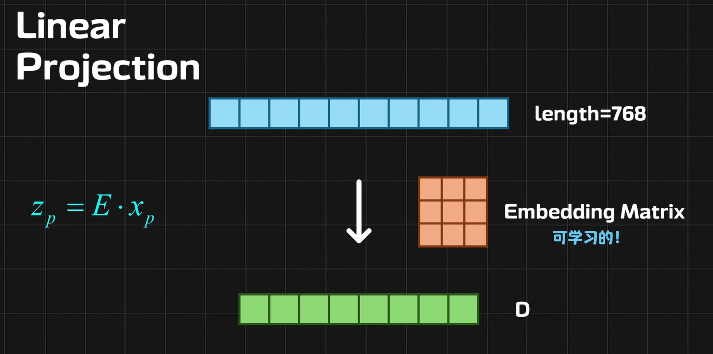
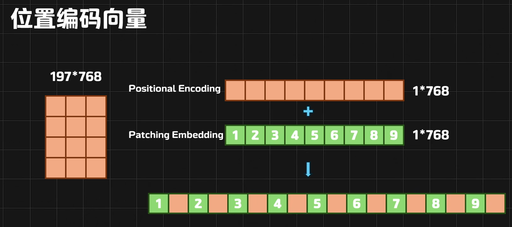
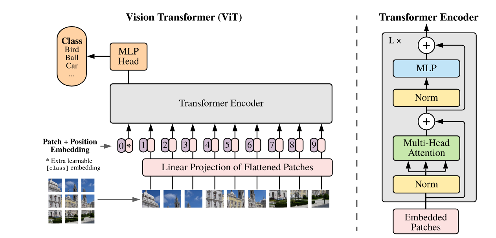

[paper](https://arxiv.org/pdf/2010.11929)
# 核心思想
ViT 的核心思想：**把一张图，硬生生地看成是一个句子。**
# 切块 (Patch Partition) —— 把图变成“单词”
Transformer 怕什么？怕序列太长。  
如果一张图是 224×224像素，直接把每个像素当成一个单词，那序列长度就是 $50.176$, Attention 机制的计算量是序列长度的平方级，这会直接把显卡算爆。

**ViT 的做法：**  
不看像素，看**小方块（Patch）**。

1. 假设输入图片是 
    224×224
2. 我们把图片切成一个个 16×16的小方格。
    
3. 算一下：$224\div16=14$,所以横竖都是 14 个块。
    
4. 总共有 $14×14=196$个小方块。
**通俗理解：**  
这一步做完，原来的一张大图，就变成了 **196 个“单词”**。序列长度瞬间从 5万 降到了 196，Transformer就可以轻松应付了

# 拉直与映射 (Linear Projection) —— 制作“词向量”

现在我们手里有 196 个小方块。但 Transformer 不认“图片块”，它只认“向量（Vector）”。
ViT 的做法：
1. 拉直（Flatten）： 拿出一个 16×16的彩色小方块（RGB 3通道）。它的数据量是 
 $16×16×3=768$个数值。把它拉成一条长长的向量。
2. 映射（Linear Projection）： 用一个全连接层（Linear Layer），把这个 768 维的向量，映射成 Transformer 想要的维度（比如也是 768，或者 1024，看模型大小）。
**通俗理解：**
这一步就是 NLP 里的 Embedding（词嵌入） 过程。
• NLP：单词 ID →查表 →词向量
• ViT：图片块像素 →矩阵乘法 →块向量 (Patch Embedding)

# 分类向量(\[CLS] Token)
我们要给图片分类（比如这是猫还是狗），应该用哪个方块的输出来代表整张图呢？是左上角的块？还是中间的块？都不合适，因为重要信息可能在任何地方。

**ViT 的做法：**  
无中生有！  
在刚才那 196 个向量的最前面，**强行插入**一个专门用来做分类的向量。  
这个向量是**可学习的**（一开始是随机的，随着训练越来越准）。

现在序列长度变成了：196+1=197。

**通俗理解：**  
这个 \[CLS] Token 就像是一个**班长**。它的任务是在后续的计算中，跟其他 196 个“同学”（图片块）不断交流（Attention），最后把全班的信息总结在自己身上，代表整个班级（整张图片）去回答老师的问题（分类）。

# Position Embedding(位置编码)

- **Patch Embedding:** 形状是 \[196,768]
   
    
- **Position Embedding:** 形状也是 \[196,768]
ViT 采用的是直接**相加 (Element-wise Sum)**。  
$Input=Patch_Embed+Pos_EmbedInput$
**相加不会破坏原来的特征吗？**  
实际上，维度很高（768维），数据分布在不同维度上。模型非常聪明，它学会了将“语义信息”和“位置信息”编码在同一个向量的不同子空间里，互不干扰。

#### 2. 位置编码长什么样？(1D vs 2D)

在 ViT 的论文里，作者做了一个有趣的实验。既然图片是二维的（行和列），我们是不是应该用 2D 编码（比如记录 x=1, y=1）？

- **2D 编码：** 比如 X轴编码 + Y轴编码。
    
- **1D 编码：** 直接把 Patch 编号为 0, 1, 2, ..., 195。
    

**结果发现：** ViT 最终使用的是 **1D 可学习的位置编码 (Learnable 1D Position Embedding)**。  
也就是给每个位置初始化一个随机向量，然后通过梯度下降让模型自己去学“1号位置在哪里”，“2号位置在哪里”。

**这怎么可能学得会？**  
模型在训练后，我们把学到的位置编码可视化（算余弦相似度），会发现惊人的现象：

- 第 5 号位置的向量，和第 6 号（右边）、第 4 号（左边）、第 19 号（正下方）的向量非常相似。
    
- 也就是说，模型虽然只拿到了 1D 编号，但它自己**学会了还原 2D 的网格结构**。
    
#### 3. 处理 \[CLS] Token
实际的 Position Embedding 长度是 **197**（1个班长 + 196个Patch）。

- 第 0 号位置编码：专门给 \[CLS] Token 用。
    
- 第 1-196 号位置编码：给图片块用。
    

#### 4. 遇到不同分辨率的图怎么办？

这是 ViT 的一个痛点。  
如果你训练时用 224×224(14x14个块)，位置编码只有 196 个。  
预测时来了一张 384×384的大图 (24x24 = 576个块).原来的 196 个位置编码不够用了，也不对应了。

**解决方法：插值 (Interpolation)。**  
把那原本的 14×14 的位置编码矩阵，像放大图片一样，通过“双线性插值”拉伸到 24×24。虽然会损失一点精度，但只要微调一下就能用。
# Transformer Encoder
这一步你和 NLP 的 Transformer **完全一模一样**。

数据进入了多层 Transformer Encoder 堆叠结构：

1. **Layer Norm**
    
2. **Multi-Head Self-Attention (MSA)：**
    
    - 这是核心。这时候，班长 (\[CLS]) 会问每一个图片块：“你是不是猫的耳朵？”“你是不是猫的尾巴？”
        
    - 图片块之间也在交流：“我是猫身子，我旁边应该是猫腿。”
        
    - 因为 Attention 是**全局**的，所以左上角的像素可以直接和右下角的像素发生关系（不像 CNN 只能看局部）。
        
3. **MLP (多层感知机)**
    
4. **残差连接 (Residual Connection)**
    

经过 L 层的“交流”和“提炼”，信息不断聚合。

# 分类 (MLP Head)
经过了 Transformer 的千锤百炼，虽然输出了 197 个向量，但我们**只需要第 0 个**（也就是那个 \[CLS] token）。

**ViT 的做法：**

1. 把 \[CLS] 向量提取出来。
    
2. 扔进一个普通的分类层（MLP）。
    
3. 输出 Softmax 概率

# ViT 和 CNN 的本质区别

1. **视野不同（Receptive Field）：**
    
    - **CNN** 像是在用放大镜看图。一开始只能看到 3×3的局部，要堆很多层才能看到整体。
        
    - **ViT** 像是一眼看全局。第一层 Transformer 里，左上角的块就能和右下角的块计算 Attention。这就是**全局建模能力**。
        
2. **归纳偏置 (Inductive Bias)：**
    
    - **CNN** 预设了很多假设：比如“平移不变性”（猫在左边和右边是一样的）。这让 CNN 在小数据上学得很快。
        
    - **ViT** 没有任何假设。它是一张白纸，全靠数据喂出来。所以 ViT **在大数据量下（如 JFT-300M, ImageNet-21k）效果惊人**，但在小数据上往往打不过 ResNet，因为它太自由了，需要海量数据来教规矩。
# 模型框架

**流程：** **图片 (Image)** →**切块与投影 (Patch Embedding)** →**加身份与位置 (CLS & Pos)** →**Transformer 编码器 (Encoder)** →**取CLS分类 (MLP Head)**
