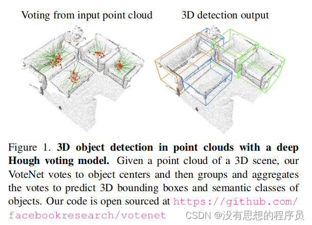

# 论文
[vote](https://arxiv.org/pdf/1904.09664)
# 简介
**背景：** 
3d点云检测面临的挑战：3D的物体的中心（质心）是远离物体的表面的，而点云中的点都是扫描物体表面得到的，这样点云的内部就是空心的，因此就很难去找到物体中心。

**作者提出的方法：**
为了应对这一挑战，作者提出了 VoteNet，这是一种基于深度点集网络和***霍夫投票***协同作用的端到端 3D 对象检测网络。我们的模型通过简单的设计、紧凑的模型尺寸和高效率，在两个大型真实 3D 扫描数据集 ScanNet 和 SUN RGB-D 上实现了最先进的 3D 检测。值得注意的是，VoteNet 通过使用纯粹的几何信息而不依赖彩色图像，优于以前的方法。通过直接处理点云数据，不仅避免了信息的损失，而且由于处理的点云数据的稀疏性，还可以降低计算代价。

# 核心思路
使用深度 Hough 投票模型进行点云中的 3D 对象检测。给定 3D 场景的点云，我们的 VoteNet 投票给对象中心，然后对投票进行分组和聚合，以预测 3D 边界框和对象的语义类别

# 模型框架

***核心框架：***$$\text{PointNet++ (Backbone)} \rightarrow \text{Voting Module} \rightarrow \text{Vote Aggregation} \rightarrow \text{Detection Branch (Predict BBox)}$$
1. 网络结构由**原始点云输入**，维度为(20000,3)，代表输入20000个点云，每个点云都有xyz三个坐标
2. 作者使用**pointnet++骨干网络提取特征**，骨干网络的输入为原始点云，维度为(20000,3)，pointnet++主要通过4层SA模块和2层FP模块进行特征提取，经过骨干网络提取出来1024个点，这些点称为种子点(或兴趣点)，种子点坐标维度为(8,1024,3)，种子点的特征维度为(8,1024,256)，8是batch，1024是种子点的个数，3是xyz坐标，256是特征数
3. 将提取出来的种子点送到**votelayer进行投票**，这里种子点特征将通过三层一维卷积和两层BN层，输出一个张量offset，维度为(8,1024,1,259)，votelayer输出的是种子点到投票点的位移偏移量offset以及投票点的特征vote_features，所以要的到投票点的坐标需要用种子点的坐标加上得到的偏移量，vote_xyz=seed_xyz+offset，投票点坐标的维度也是(8,1024,3),投票点的特征是将输出特征加上种子点特征得到的vote_features=seed_features+offset，(由于输出的维度和种子点维度不一致，这里还需要将维度进行变换才可以相加)
4. 得到投票点坐标以及投票点特征后需要对投票点进行**聚合**，作者使用的是pointnet中的SA模块进行聚合，将1024个投票点聚合成256个点aggregated_points，维度为(8,256,3），其特征为aggregated_features(8,256,128）
5. 将聚合好的投票点进行**候选框预测**， 每个聚合后的点会投票产生一个候选结果。根据聚合后的特征，VoteNet通过分类head和回归head产生预测的候选框结果。aggregated_features（256x128）通过两层一维卷积进行更深层特征提取，提取后的特征分别经过一层卷积得到分类预测结果cls_precls_predictions（256x12）和位置回归预测结果reg_predictions（256x67）
6. 最后一步就是将结果进行**解码**，预测结果如何与真实标签关联需要一一进行解码。真实标签主要包含目标有无、类别标签和目标回归位置。

# Vote机制

## 1.投票模块 (Voting Module): 将点云中的点偏移到物体中心，产生了密集的投票簇。
**霍夫变换 (Hough Transform)** ，它是一种强大的技术，常用于图像处理中检测形状，比如直线或圆。它的核心思路是：将空间中的一个数据点（比如图像中的一个边缘点）映射到参数空间（称为累加器空间），让这个点**投票**给所有可能的形状参数。形状参数的交汇处（票数最多的地方）就是检测到的形状。

VoteNet 正是将这个思想搬到了 3D 点云的深度学习中：

- **输入点与投票:** VoteNet 的骨干网络（例如 PointNet++）从输入点云中提取特征，然后将特征输入到**投票模块 (Voting Module)** 中。
    
- **预测偏移:** 投票模块让点 $\mathbf{x}_i$ 预测一个 3D 偏移向量 $\mathbf{v}_i$（即 $\Delta x, \Delta y, \Delta z$），这个向量指向它所属对象的**中心**。
    
- **中心聚集:** 最终，多个点投出的票会聚集在真实对象中心的位置，形成高密度的**投票簇 (Vote Clusters)**。
    
这种方法巧妙地利用了深度学习的能力来学习精确的偏移量，实现了“深度”投票。

## 2.投票聚合 (Set Abstraction): 在这些投票点上应用 PointNet++ 的 Set Abstraction (FPS + 球查询 + PointNet)，实现了高效的特征提取和降维。

# 检测分支 (Detection Branch)

VoteNet 的 **检测分支** 主要负责从聚合的特征向量中预测以下四个关键信息：

- **1. 类别标签 (Class Label) 🏷️:** 这个物体是什么（车、人、自行车等）。
    
- **2. 尺寸 (Size/Box size) 📏:** 它的长 $L$、宽 $W$、高 $H$。
    
- **3. 方向角 (Heading) 🧭:** 它的旋转角度 $\theta$。
    
- **4. 置信度 (Confidence Score) 💯:** 这个预测的可靠性。

