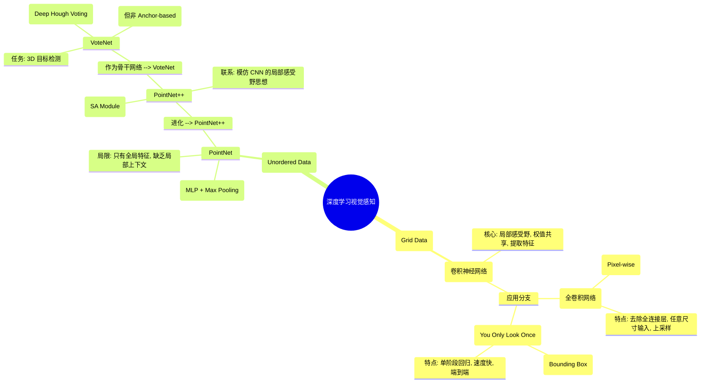

| 维度        | 基础架构                      | 语义分割模型              | 目标检测模型      |
| --------- | ------------------------- | ------------------- | ----------- |
| **2D 图像** | **CNN** (如 ResNet, VGG)   | **FCN**             | **YOLO**    |
| **3D 点云** | **PointNet / PointNet++** | PointNet/++ (自带分割头) | **VoteNet** |

# 模型的联系
### 维度一：核心机制的共同点——“权值共享”与“特征聚合”

这是所有深度学习视觉模型最底层的共同基因。

**1. 权值共享 (Weight Sharing)**  
这是深度学习高效处理大规模数据的核心。

- **CNN / FCN / YOLO (2D):** 使用**卷积核 (Kernel)** 在图像上滑动。无论在这个角落还是那个角落，提取特征的参数是一样的。
    
- **PointNet / PointNet++ / VoteNet (3D):** 使用**共享 MLP (Shared MLP)**。对点云中的每一个点，都使用完全相同的矩阵进行乘法运算。
    
- **联系：** 实际上，**PointNet 中的 Shared MLP 在数学上等价于 CNN 中的** 
    
    **`1×11×1`**
    
     **卷积**。它们都是为了提取每个像素/点的特征，而不受位置限制。
    

**2. 聚合操作 (Aggregation/Pooling)**  
为了提取全局信息，模型必须把分散的信息汇总。

- **CNN:** 使用 Max Pooling 或 Average Pooling 缩小尺寸，扩大感受野。
    
- **PointNet 系列:** 使用 Max Pooling（对称函数）来解决点云的无序性问题，提取全局特征。
    
- **共同点：** 都在做**降维**和**特征提炼**。
    

---

### 维度二：架构设计的联系——“骨干网络 + 任务头”

这六个模型都遵循现代计算机视觉的通用范式：**Backbone（骨干） + Head（任务头）**。

|   |   |   |   |
|---|---|---|---|
|角色|2D 模型|3D 模型|功能|
|**Backbone** (负责“看懂”数据)|**CNN** (如 ResNet, VGG)|**PointNet++** (最常用)   **PointNet**|提取特征 (Feature Extraction) 从输入数据中提取向量表示|
|**Head** (负责“解决”问题)|**FCN 的卷积层** **YOLO 的检测头**|**PointNet 的分割头** **VoteNet 的投票模块**|根据特征输出结果 (分类/框/掩码)|

- **FCN 与 YOLO 的联系：** 它们可能共用同一个 CNN（比如都用 ResNet50）作为骨干，只是最后接出来的“头”不一样——FCN 接的是上采样层做分割，YOLO 接的是回归层做检测。
    
- **VoteNet 与 PointNet++ 的联系：** VoteNet 并不是一个完全独立的网络，它直接“寄生”在 PointNet++ 上。它利用 PointNet++ 提取种子点特征，然后接上自己的“霍夫投票头”来生成边界框。
    

---

### 维度三：进化逻辑的联系——“局部感受野”的回归

这是 3D 网络向 2D 网络“致敬”的过程。

**1. 2D 的成功秘诀：局部性 (Locality)**

- **CNN** 的强大在于它不是一下子看全图，而是一层一层通过卷积核看**局部**（感受野），从纹理组合成形状，再组合成物体。
    

**2. 3D 的困境与回归**

- **PointNet** 最大的缺陷是它一下子看所有点（全局），导致它很难识别复杂的局部几何结构（就像一个人只看轮廓看不清细节）。
    
- **PointNet++** 的出现，就是为了**在 3D 点云中复刻 CNN 的“局部感受野”**。
    
    - 它把点云切分成很多小球（Grouping）。
        
    - 在每个小球里单独做 PointNet（相当于 CNN 的卷积操作）。
        
    - 这也是为什么 PointNet++ 效果远好于 PointNet 的原因——它学到了 CNN 的精髓。
        

---

### 维度四：任务映射 (Mapping)——跨维度的“双胞胎”

我们可以把它们看作平行宇宙中的对应存在：

#### 1. 语义分割 (Semantic Segmentation)

- **2D 代表：FCN**
    
- **3D 代表：PointNet (分割模式) / PointNet++**
    
- **共同点：** 都是 **Encoder-Decoder** 结构。先降采样提取特征（Encoder），再上采样（Upsampling/Interpolation）恢复到原始分辨率，对每个点/像素进行分类。
    

#### 2. 目标检测 (Object Detection)

- **2D 代表：YOLO**
    
- **3D 代表：VoteNet**
    
- **联系：**
    
    - **YOLO** 将图像划分为网格 (Grid)，每个网格负责预测中心落在该格子的物体。
        
    - **VoteNet** 将点云采样为种子点 (Seeds)，每个种子点负责“投票”出物体中心。
        
    - **本质：** 都在试图找到物体的**中心点**，然后回归出长宽高。
        

---

### 总结：

**CNN** 定义了视觉处理的“特征提取”范式（卷积、池化、局部性）；**FCN** 和 **YOLO** 将其分别应用于 2D 的分割和检测；为了将这套范式搬到 3D，**PointNet** 用最大池化解决了无序性问题，**PointNet++** 找回了局部性（模仿 CNN）；最终，**VoteNet** 使用 PointNet++ 提取的特征，解决了 3D 空间中的“YOLO 式”检测问题。